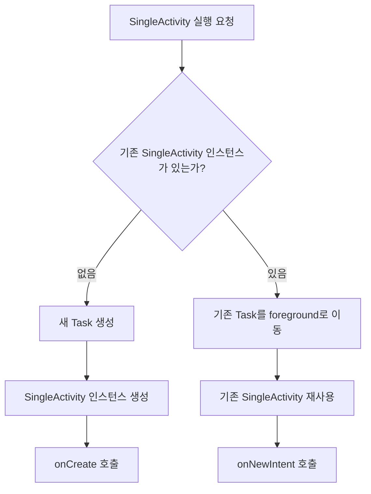

| 항목 | 내용 | 
|---|---| 
| 작성일자 | 2026.07.06 | 
| 작성자 | kimmandoo | 
| 카테고리 | android | 
| 난이도 | 기본 | 

## 질문

> Activity가 Single 인스턴스로 유지되려면 어떻게 해야될까?

## 핵심 답변

`AndroidManifest.xml` 매니페스트 파일의 `<activity>` 태그에 `android:launchMode="singleInstance"` 속성을 설정하면 됩니다. `singleInstance`로 설정된 Activity는 새로운 Task에서 실행되며, 그 Task에는 그 Activity 인스턴스 하나만 존재하게 됩니다. 이후 해당 Activity로 들어오는 모든 Intent는 이 기존 인스턴스의 `onNewIntent()`를 호출하게 됩니다.

---

## 해설


```xml
<activity 
    android:name=".SingleActivity" 
    android:launchMode="singleInstance" 
    android:exported="false" 
    />
```

Activity는 실행될 때마다 새 인스턴스가 만들어질 수 있다. 

기본 launch mode는 standard이며, 같은 Activity를 여러 번 실행하면 Back Stack 안에 같은 Activity 인스턴스가 여러 개 쌓일 수 있다.

```text
Task A
└── MainActivity
    └── DetailActivity
        └── MainActivity
            └── MainActivity
```

`android:launchMode="singleInstance"`를 설정하면 해당 Activity는 별도의 Task에서 실행되고, 그 Task 안에는 오직 그 Activity 하나만 존재한다. 아래처럼.

```text
Task A
└── MainActivity

Task B
└── SingleActivity
```

다시 SingleActivity를 실행하면 새로운 인스턴스를 만들지 않고 기존에 살아 있는 SingleActivity 인스턴스를 재사용하고, 새로 전달된 Intent는 `onNewIntent()`로 전달된다.

singleTask랑 헷갈릴 수 있다.

singleTask는 Activity를 Task의 root로 두고 기존 인스턴스를 재사용하는 방식이고, singleInstance는 거기에 더해 그 Task에 다른 Activity가 들어오지 못하게 한다. 해당 Activity에서 다른 Activity를 실행하면 그 Activity는 별도 Task에 배치된다.



singleInstance는 Activity 인스턴스를 하나로 유지할 수 있지만, 해당 Activity가 별도 Task에 단독으로 배치되기 때문에 일반적인 Back Stack 흐름과 달라질 수 있다. 예를 들어보겠다.

```text
Task 1
└── MainActivity
    └── DetailActivity
        └── SettingActivity
```
이렇게 되어있으면, SettingActivity 종료 -> DetailActivity로 복귀 -> MainActivity로 복귀 -> 앱 종료 를 기대할 것이다.

근데 DetailActivity를 singleInstance로 설정하면 MainActivity에서 DetailAcitivity를 열었을 때 아래처럼 될 것이다.

```text
Task 1
└── MainActivity

Task 2
└── DetailActivity
```

MainActivity -> DetailActivity -> Back -> MainActivity 이렇게 될까?

상황에 따라 달라진다. 이전 Task로 가게되므로 MainActivity일 수도 있고, 다른 화면일 수도 있게 된다.

그래서 판단은 보통 아래처럼한다.

```text
그냥 같은 화면이 여러 번 쌓이는 것만 막고 싶다
-> singleTop 먼저 고려

앱의 특정 진입점 화면을 하나로 유지하고 싶다
-> singleTask 고려

정말 이 화면은 독립적으로 하나만 떠야 하고,다른 화면과 같은 Back Stack에 섞이면 안 된다
-> singleInstance 고려
```

통화 화면, PiP 재생 화면, 외부 장치 제어 화면같은 완전 독립이 필요한 것들을 singleInstance 예시라고 생각하면 될 것 같다.

### launchMode 표(공식문서)

| 사용 사례                       | 시작 모드                   | 다중 인스턴스? | 참고                                                                                                                                                     |
| --------------------------- | ----------------------- | -------- | ------------------------------------------------------------------------------------------------------------------------------------------------------ |
| 대다수 Activity의 일반적인 시작       | `standard`              | 예        | 기본값입니다. 시스템은 항상 대상 Task에 새 Activity 인스턴스를 생성하고, Intent를 새 인스턴스로 라우팅합니다.                                                                                |
| 대다수 Activity의 일반적인 시작       | `singleTop`             | 조건부      | Activity 인스턴스가 이미 대상 Task의 맨 위에 있으면 새 인스턴스를 만들지 않고 `onNewIntent()`를 호출하여 Intent를 기존 인스턴스로 라우팅합니다. 맨 위에 없으면 새 인스턴스를 생성합니다.                              |
| 특수한 시작<br>(일반 용도에는 권장되지 않음) | `singleTask`            | 조건부      | 시스템은 새 Task의 루트에 Activity를 만들거나, 같은 affinity를 가진 기존 Task에서 Activity를 찾습니다. Activity 인스턴스가 이미 존재하고 Task의 루트에 있으면 새 인스턴스를 만들지 않고 `onNewIntent()`를 호출합니다. |
| 특수한 시작<br>(일반 용도에는 권장되지 않음) | `singleInstance`        | 아니요      | `singleTask`와 비슷하지만, 해당 Activity 인스턴스를 보유한 Task에는 다른 Activity가 실행되지 않습니다. 이 Activity는 항상 해당 Task의 유일한 멤버입니다.                                           |
| 특수한 시작<br>(일반 용도에는 권장되지 않음) | `singleInstancePerTask` | 조건부      | 이 Activity는 Task의 루트 Activity로만 실행될 수 있으므로 하나의 Task 안에는 이 Activity 인스턴스가 하나만 존재합니다. 다만 서로 다른 Task에서는 여러 번 인스턴스화될 수 있습니다.                               |


---

## 꼬리 질문

- singleInstance와 singleTask의 차이는 무엇인가?
- singleTop만으로 Activity 중복 생성을 막을 수 있는가?
- onCreate()와 onNewIntent()는 각각 언제 호출되는가?
- launchMode와 Intent flag 중 어떤 방식이 더 적절한가?
- FLAG_ACTIVITY_NEW_TASK, FLAG_ACTIVITY_CLEAR_TOP, FLAG_ACTIVITY_SINGLE_TOP은 각각 어떤 차이가 있는가?
- singleInstance를 사용하면 Back 버튼 동작이 어떻게 달라지는가?
- 딥링크나 알림 클릭으로 Activity를 열 때 launchMode를 어떻게 설계해야 하는가?
- singleInstance Activity에서 다른 Activity를 실행하면 같은 Task에 쌓이는가?
- Activity 인스턴스를 하나로 유지하는 것과 앱 프로세스를 유지하는 것은 같은 의미인가?
- Android에서 Task와 Back Stack은 어떤 관계인가?

---

## 실무 연결

해당 개념이 백엔드 개발, 장애 대응, 성능 개선, 시스템 설계에서 어떻게 쓰이는지 작성합니다.

---

## 참고 자료

- [tasks-and-back-stack](https://developer.android.com/guide/components/activities/tasks-and-back-stack?utm_source=chatgpt.com&hl=ko)
- [launchmode](https://developer.android.com/guide/topics/manifest/activity-element?hl=ko)